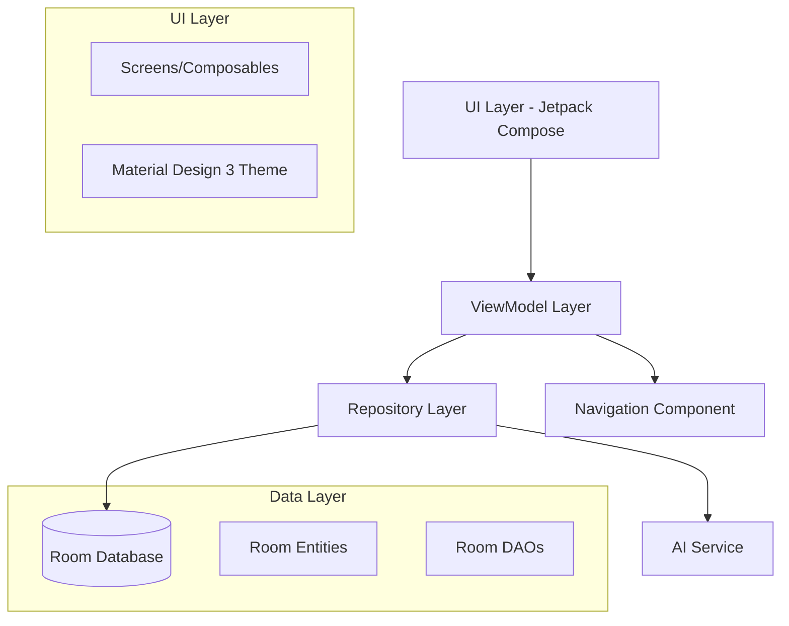

# Design Document

## Overview

The expense tracker is a native Android application built for Android 13+ using modern Android development practices. The app follows Material Design 3 principles and uses Jetpack Compose for the UI, Room database for local storage, and integrates AI capabilities for natural language expense processing. The architecture follows MVVM pattern with Repository pattern for data management.

## Architecture

### High-Level Architecture



### Technology Stack

- **UI Framework**: Jetpack Compose with Material Design 3
- **Architecture**: MVVM with Repository pattern
- **Database**: Room (SQLite wrapper)
- **Dependency Injection**: Hilt
- **Navigation**: Jetpack Navigation Compose
- **Charts**: Vico or MPAndroidChart
- **AI Integration**: Local LLM or cloud API (OpenAI/Gemini)
- **Date/Time**: Java 8 Time API
- **Async Operations**: Kotlin Coroutines + Flow

## Components and Interfaces

### UI Components

#### Main Navigation Structure
```kotlin
sealed class Screen(val route: String) {
    object ExpenseList : Screen("expense_list")
    object AddExpense : Screen("add_expense")
    object Analytics : Screen("analytics")
    object AIChat : Screen("ai_chat")
    object RecurringExpenses : Screen("recurring")
    object Settings : Screen("settings")
}
```

#### Key Composables
- `ExpenseListScreen`: Main screen showing expense history with filtering
- `AddExpenseScreen`: Form-based expense entry with validation
- `AnalyticsScreen`: Charts and insights with period comparison
- `AIChatScreen`: Natural language expense entry interface
- `RecurringExpensesScreen`: Manage recurring expense templates
- `ExpenseCard`: Reusable component for displaying individual expenses
- `CategoryChip`: Interactive category selection component
- `TagInput`: Multi-tag input with autocomplete
- `PeriodSelector`: Date range picker for analytics

### ViewModels

#### ExpenseViewModel
```kotlin
class ExpenseViewModel @Inject constructor(
    private val repository: ExpenseRepository
) : ViewModel() {
    val expenses: StateFlow<List<Expense>>
    val categories: StateFlow<List<Category>>
    val tags: StateFlow<List<String>>
    
    fun addExpense(expense: Expense)
    fun updateExpense(expense: Expense)
    fun deleteExpense(expenseId: Long)
    fun filterExpenses(filter: ExpenseFilter)
}
```

#### AnalyticsViewModel
```kotlin
class AnalyticsViewModel @Inject constructor(
    private val repository: ExpenseRepository
) : ViewModel() {
    val analyticsData: StateFlow<AnalyticsData>
    
    fun loadAnalytics(period: TimePeriod)
    fun comparePeriodsData(period1: TimePeriod, period2: TimePeriod)
}
```

#### AIChatViewModel
```kotlin
class AIChatViewModel @Inject constructor(
    private val aiService: AIService,
    private val repository: ExpenseRepository
) : ViewModel() {
    val chatMessages: StateFlow<List<ChatMessage>>
    val parsedExpense: StateFlow<ParsedExpense?>
    
    fun processNaturalLanguageInput(input: String)
    fun confirmParsedExpense(expense: ParsedExpense)
}
```

### Repository Layer

#### ExpenseRepository
```kotlin
interface ExpenseRepository {
    fun getAllExpenses(): Flow<List<Expense>>
    fun getExpensesByDateRange(start: LocalDate, end: LocalDate): Flow<List<Expense>>
    fun getExpensesByCategory(categoryId: Long): Flow<List<Expense>>
    fun getExpensesByTags(tags: List<String>): Flow<List<Expense>>
    suspend fun insertExpense(expense: Expense): Long
    suspend fun updateExpense(expense: Expense)
    suspend fun deleteExpense(expenseId: Long)
    fun getAllCategories(): Flow<List<Category>>
    fun getAllTags(): Flow<List<String>>
    suspend fun insertCategory(category: Category): Long
    fun getRecurringExpenses(): Flow<List<RecurringExpense>>
    suspend fun insertRecurringExpense(recurringExpense: RecurringExpense)
}
```

## Data Models

### Room Entities

#### Expense Entity
```kotlin
@Entity(tableName = "expenses")
data class Expense(
    @PrimaryKey(autoGenerate = true)
    val id: Long = 0,
    val amount: BigDecimal,
    val currency: String,
    val description: String,
    val categoryId: Long,
    val tags: List<String>, // Stored as JSON string
    val date: LocalDateTime,
    val createdAt: LocalDateTime = LocalDateTime.now(),
    val updatedAt: LocalDateTime = LocalDateTime.now()
)
```

#### Category Entity
```kotlin
@Entity(tableName = "categories")
data class Category(
    @PrimaryKey(autoGenerate = true)
    val id: Long = 0,
    val name: String,
    val color: String, // Hex color code
    val icon: String, // Material icon name
    val isDefault: Boolean = false,
    val createdAt: LocalDateTime = LocalDateTime.now()
)
```

#### RecurringExpense Entity
```kotlin
@Entity(tableName = "recurring_expenses")
data class RecurringExpense(
    @PrimaryKey(autoGenerate = true)
    val id: Long = 0,
    val amount: BigDecimal,
    val currency: String,
    val description: String,
    val categoryId: Long,
    val tags: List<String>,
    val frequency: RecurrenceFrequency,
    val startDate: LocalDate,
    val endDate: LocalDate?,
    val lastGenerated: LocalDate?,
    val isActive: Boolean = true,
    val createdAt: LocalDateTime = LocalDateTime.now()
)

enum class RecurrenceFrequency {
    DAILY, WEEKLY, MONTHLY, YEARLY
}
```

### Data Transfer Objects

#### ParsedExpense (for AI processing)
```kotlin
data class ParsedExpense(
    val amount: BigDecimal?,
    val currency: String?,
    val description: String,
    val suggestedCategory: String?,
    val suggestedTags: List<String>,
    val confidence: Float,
    val originalInput: String
)
```

#### AnalyticsData
```kotlin
data class AnalyticsData(
    val totalSpending: BigDecimal,
    val categoryBreakdown: Map<Category, BigDecimal>,
    val monthlyTrends: List<MonthlySpending>,
    val topTags: List<TagSpending>,
    val periodComparison: PeriodComparison?
)
```

### Room Database

#### AppDatabase
```kotlin
@Database(
    entities = [Expense::class, Category::class, RecurringExpense::class],
    version = 1,
    exportSchema = false
)
@TypeConverters(Converters::class)
abstract class AppDatabase : RoomDatabase() {
    abstract fun expenseDao(): ExpenseDao
    abstract fun categoryDao(): CategoryDao
    abstract fun recurringExpenseDao(): RecurringExpenseDao
}
```

## Error Handling

### Validation Strategy
- **Input Validation**: Real-time validation in Compose UI with error states
- **Business Logic Validation**: Repository layer validates business rules
- **Database Constraints**: Room entities with appropriate constraints
- **AI Processing Errors**: Graceful fallback when AI service fails

### Error Types
```kotlin
sealed class ExpenseError : Exception() {
    object InvalidAmount : ExpenseError()
    object MissingCategory : ExpenseError()
    object DatabaseError : ExpenseError()
    object AIServiceUnavailable : ExpenseError()
    data class ValidationError(val field: String, val message: String) : ExpenseError()
}
```

### Error Handling Implementation
- Use `Result<T>` wrapper for repository operations
- Display user-friendly error messages in UI
- Log errors for debugging without exposing sensitive data
- Provide retry mechanisms for transient failures

## Testing Strategy

### Unit Testing
- **ViewModels**: Test business logic and state management
- **Repository**: Test data operations with in-memory database
- **AI Service**: Mock AI responses for consistent testing
- **Utilities**: Test date/currency formatting and validation

### Integration Testing
- **Database Operations**: Test Room DAOs with real database
- **End-to-End Flows**: Test complete user workflows
- **AI Integration**: Test natural language processing accuracy

### UI Testing
- **Compose Testing**: Test UI components and interactions
- **Navigation Testing**: Verify screen transitions
- **Accessibility Testing**: Ensure proper content descriptions and navigation

### Testing Tools
- JUnit 5 for unit tests
- Mockk for mocking
- Room testing utilities
- Compose testing framework
- Espresso for integration tests

## Performance Considerations

### Database Optimization
- Proper indexing on frequently queried columns (date, categoryId)
- Pagination for large expense lists
- Background database operations using coroutines
- Database migrations for schema changes

### UI Performance
- Lazy loading for expense lists
- Image caching for category icons
- Efficient recomposition in Compose
- Background processing for analytics calculations

### Memory Management
- Proper lifecycle management in ViewModels
- Efficient data structures for large datasets
- Image optimization for charts and icons
- Garbage collection considerations for long-running operations

## Security and Privacy

### Data Protection
- Local-only storage with no cloud sync
- Encrypted database using SQLCipher (optional)
- No sensitive data in logs
- Secure handling of AI API keys (if using cloud AI)

### Privacy Considerations
- No data collection or analytics
- User consent for AI features
- Clear data retention policies
- Export/import functionality for user data control